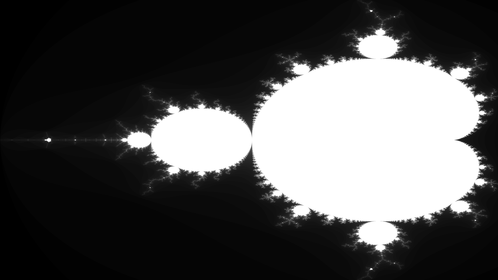

The Mandelbrot set is defined as the set of complex numbers where if you take the function $f_c(z) = z^2 + c$ and recursively evaluate it starting with $z = 0$ and a given $c$ where it does not diverge.
We can graph this by representing each pixel with position or $c$ value on the complex plane.

I will be using Rust with minifb for a framebuffer and rayon for multithreading.
```toml
[dependencies]
minifb = "0.24.0"
rayon = "1.7.0"
```
First of all let's create a buffer for our image and set up minifb.

```rust
use minifb::{Key, Window, WindowOptions};
use std::error::Error;

const WIDTH: usize = 2560;
const HEIGHT: usize = 1440;

fn main() -> Result<(), Box<dyn Error>> {
    let mut buffer: Vec<u32> = vec![0; WIDTH * HEIGHT];

    let mut window = Window::new("Mandelbrot Set", WIDTH, HEIGHT, WindowOptions::default())?;

    window.limit_update_rate(Some(std::time::Duration::from_micros(16600)));

    while window.is_open() && !window.is_key_down(Key::Escape) {
        window.update_with_buffer(&buffer, WIDTH, HEIGHT)?;
    }

    Ok(())
}
```

Let's write a function to evaluate $f_c(z) = z^2 + c$.
For the sake of clarity $z_a = x$ and $z_b = y$ where $z_a$ is the real component and $z_b$ the imaginary component of the complex number $z$. Similarly $c_a = x_0$ and $c_b = y_0$. I've chosen this notation to be consistent with the Wikipedia page on the mandelbrot set. 

Rust doesn't have an inbuilt complex number primitive so we could either create our own struct or operate directly on the real and imaginary components. I've opted to operate directly on the components since we aren't doing much arithmetic. The following is $f_c(z)$ expressed in terms of the components of $z$ and $c$.

$$
\begin{align}
\nonumber f_c(z) &= z^2 + c \\
\nonumber &=(x + yi)(x + yi) + (x_0 + y_0i) \\
\nonumber &=x^2 + 2xyi - y^2 + x_0 + y_0i \\
\nonumber &=(x^2 - y^2 + x_0) + (2xy + y_0)i
\end{align}
$$

```rust
fn iterate(x: f64, y: f64, x0: f64, y0: f64) -> (f64, f64) {
    (x * x - y * y + x0, 2.0 * x * y + y0)
}
```

Now let's create a function to tell if for a given $c$ value our recursive sequence diverges or not. One of the basic properties of our sequence
is that it will diverge if at any point $|f_c(z)| > 2$ (or alternatively $|f_c(z)|^2 > 4$). This is because the entire mandelbrot set lies within a circle with radius 2. Using this property we can check for a given $c$ value if the sequence will diverge within a given amount of iterations.


```rust
const ITERATIONS: usize = 1024;

...

fn diverges(x0: f64, y0: f64) -> bool {
    // the first z value is always 0
    let (mut x, mut y) = (0.0, 0.0);

    // check if our function diverges within a given amount of iterations
    for _ in 0..ITERATIONS {
        (x, y) = iterate(x, y, x0, y0);

        // if |z|^2 > 4 the sequence diverges
        let mag_squared = x * x + y * y;
        if mag_squared > 4.0 {
            return true;
        }
    }
    false
}
```
We can now use this to graph the mandelbrot set! We'll assign the colour white to anything that fails to diverge and black to everything else.
The entire mandelbrot set lies between $-2 - 1.2i$ and $0.5 + 1.2i$ so let's map the pixels of our image to between those values. 

For example to map our pixels $y$ coordinates to our $i$ range we can use the following formula: $$y_{min} + y_{range}\frac{p_{y}}{p_{ymax}}$$, we do the same for mapping our pixels $x$ coordinates to our real number range.

```rust
use minifb::{Key, Window, WindowOptions};
use std::error::Error;

const WIDTH: usize = 2560;
const HEIGHT: usize = 1440;
const ITERATIONS: usize = 1024;

fn main() -> Result<(), Box<dyn Error>> {
    let mut buffer: Vec<u32> = vec![0; WIDTH * HEIGHT];

    // record how long the render takes
    let render_start = std::time::Instant::now();

    for (i, pixel) in buffer.iter_mut().enumerate() {
        let (pixel_x, pixel_y) = (i % WIDTH, i / WIDTH);

        // map pixels to between -2 - 1.2i and 0.5 + 1.2i
        let x0 = -2.0 + 2.5 * (pixel_x as f64 / (WIDTH - 1) as f64);
        let y0 = -1.2 + 2.4 * (pixel_y as f64 / (HEIGHT - 1) as f64);

        // if the function fails to diverge at c within ITERATIONS set the pixel to white
        if !diverges(x0, y0) {
            *pixel = u32::MAX;
        }
    }

    println!(
        "Render completed in {}ms",
        render_start.elapsed().as_millis()
    );

    ...
}
```

This takes around 3 seconds with my 5950x and produces this image:


The resulting image is rather underwelming to say the least. A lot of the interesting detail isn't there! 
This is due to our binary diverges/doesn't diverge approach. Before we improve on that aspect that let's speed up the render.

### Multithreading

Perhaps the easiest speedup would be to convert our single-threaded render loop to a multi-threaded,
we can do this with rayon by replacing `for (i, pixel) in buffer.iter_mut().enumerate() { ... }` with
`buffer.par_iter_mut().enumerate().for_each(|(i, pixel)| { ... });`

```rust
use rayon::prelude::*;

...

    buffer.par_iter_mut().enumerate().for_each(|(i, pixel)| {
        let (pixel_x, pixel_y) = (i % WIDTH, i / WIDTH);

        let x0 = -2.0 + 2.5 * (pixel_x as f64 / (WIDTH - 1) as f64);
        let y0 = -1.2 + 2.4 * (pixel_y as f64 / (HEIGHT - 1) as f64);

        if !diverges(x0, y0) {
            *pixel = u32::MAX;
        }
    });
```

The render now takes around 130ms on my 5950x (16 cores, 32 threads) which is about a ~23x speedup!

### Optimising

We can also optimise our diverges function. We'll need to inline our iterate function so let's do that.
```rust
fn diverges(x0: f64, y0: f64) -> bool {
    let (mut x, mut y) = (0.0, 0.0);

    for _ in 0..ITERATIONS {
        // iterate
        (x, y) = (x * x - y * y + x0, 2.0 * x * y + y0);

        let mag_sq = x * x + y * y;
        if mag_sq > 4.0 {
            return true;
        }
    }
    false
}
```

First of all we can move the `mag_sqaured > 4.0` check to the start of the loop and start with the values from the first iteration.
```rust
fn diverges(x0: f64, y0: f64) -> bool {
    let (mut x, mut y) = (x0, y0);

    for _ in 0..ITERATIONS {
        let mag_sq = x * x + y * y;
        if mag_sq > 4.0 {
            return true;
        }

        // iterate
        (x, y) = (x * x - y * y + x0, 2.0 * x * y + y0);
    }
    false
}
``` 

This gets us to around ~118ms. We can also store the values of $x^2$ and $y^2$ which removes some duplicate calculations.
```rust
fn diverges(x0: f64, y0: f64) -> bool {
    let (mut x, mut y) = (x0, y0);

    for _ in 0..ITERATIONS {
        let x_sq = x * x;
        let y_sq = y * y;

        if x_sq + y_sq > 4.0 {
            return true;
        }

        (x, y) = (x_sq - y_sq + x0, 2.0 * x * y + y0);
    }
    false
}
```

This doesn't seem to make a noticable difference in my case but I'm going to stick with it since it makes the code a bit neater.

#### Early Exit

A big problem with our program is that if a point falls within the main cardioid or the period 2 bulb (the circle to the left), we know that it will not diverge but our program does not, which means we will go through all (1024) iterations. Let's add a check to early exit if this is the case.

We can check if the a point is in the main cardioid with the following:
$$
q = (x-\frac{1}{4})^2 + y^2
$$
$$
4q(q + (x - \frac{1}{4})) \leq y^2
$$
We can check if a point is in the period 2 bulb with the following:
$$
(x + 1)^2 + y^2 \leq \frac{1}{16}
$$

Implementing this in code might look like this:
```rust
fn diverges(x0: f64, y0: f64) -> bool {
    let (mut x, mut y) = (x0, y0);
    let (mut x_sq, mut y_sq) = (x0 * x0, y0 * y0);

    // early exit
    let t = x - 0.25;
    let t2 = x + 1.0;
    let q = t * t + y_sq;

    // check if point lies within the main cardioid or the period 2 bulb
    if 4.0 * q * (q + t) <= y_sq || t2 * t2 + y_sq <= 0.0625 {
        return false;
    }

    // check if our function diverges within a given amount of iterations
    for _ in 0..ITERATIONS {
        // if |z|^2 > 4 it diverges
        if x_sq + y_sq > 4.0 {
            return true;
        }

        // iterate
        y = 2.0 * x * y + y0;
        x = x_sq - y_sq + x0;
        y_sq = y * y;
        x_sq = x * x;
    }
    false
}
```
Note that I've also calculated the initial x and y squared outside of loop. I've found that doing this before applying the early exit optimisation reduces performance by around ~20ms to ~140ms for some reason. It doesn't seem to make a noticable difference after implementing the early exit.

After implementing early exit the render time is around 17ms.

#### Symmetry

The Mandelbrot set is symmetric aross the x axis / real number line. We can use this to our advantage to only render the top half of the image then flip it.


```rust
const HALF_HEIGHT: usize = HEIGHT / 2;

fn main() -> Result<(), Box<dyn Error>> {
    let mut buffer: Vec<u32> = vec![0; WIDTH * HALF_HEIGHT];

    let render_start = std::time::Instant::now();

    buffer.par_iter_mut().enumerate().for_each(|(i, pixel)| {
        ...
    });

    let second_half = buffer
        .chunks(WIDTH)
        .rev()
        .flatten()
        .copied()
        .collect::<Vec<u32>>();

    buffer.extend(second_half);

    ...
}
```

This brings the render time down to around 14ms. I suspect that there are unnecessary allocations but it works well enough.

#### Cycles

Another optimisation we can make is checking for cycles while we are iterating, if we detect a cycle it means that point will never diverge so we can exit early.

To detect cycles we can store the initial value of z after the first iteration and check if any of the preceding z values match. We can update our value of z every so often since cycles don't have to start from the first z value.

```rust
fn diverges(x0: f64, y0: f64) -> bool {
    ...

    // values for cycle checking
    let mut x_old = x0;
    let mut y_old = y0;

    // check if our function diverges within a given amount of iterations
    for depth in 0..ITERATIONS {
        // if |z|^2 > 4 it diverges
        if x_sq + y_sq > 4.0 {
            return true;
        }

        // iterate
        y = 2.0 * x * y + y0;
        x = x_sq - y_sq + x0;

        // check if in cycle
        if (x - x_old).abs() < 0.000001 && (y - y_old).abs() < 0.000001 {
            return false;
        }

        y_sq = y * y;
        x_sq = x * x;

        // update cycle point every 20 iterations
        if depth % 20 == 0 {
            x_old = x;
            y_old = y;
        }
    }
    false
}
```

This brings down the render time to around 12ms.

### Better graphing

Currently we have a binary diverges/doesn't diverge colouring which leaves out a lot of detail. Instead we can colour based on how many iterations it takes it cross our threshold of 2.

First let's modify the diverges function to return the iteration it crossed our threshold of 2 on or otherwise return the max iteration.

```rust
fn diverges(x0: f64, y0: f64) -> usize {
    ...

    // early exit for period 2 bulb or cardioid
    if 4.0 * q * (q + t) <= y_sq || t2 * t2 + y_sq <= 0.0625 {
        return ITERATIONS;
    }

    ...

    // check if our function diverges within a given amount of iterations
    for depth in 0..ITERATIONS {
        // if |z|^2 > 4 it diverges
        if x_sq + y_sq > 4.0 {
            return depth;
        }

        ...

        // check if in cycle
        if (x - x_old).abs() < 0.000001 && (y - y_old).abs() < 0.000001 {
            return ITERATIONS;
        }

        ...
    }
    ITERATIONS
}

```

Lets create a function that takes iteration and returns a colour:
```rust
fn colour_from_iteration(depth: usize) -> u32 {
    let t = 1.0 - depth as f64 / ITERATIONS as f64;

    let greyscale = ((1.0 - t.powi(10)) * 255.0) as u32;

    // minifb uses 0RGB so this represents rgb(greyscale, greyscale, greyscale)
    greyscale << 16 | greyscale << 8 | greyscale
}
```

The above interpolates between black and white given an iteration count.

We also need to modify our buffer creation:
```rust
    buffer.par_iter_mut().enumerate().for_each(|(i, pixel)| {
        ...

        let depth = diverges(x0, y0);
        *pixel = colour_from_iteration(depth);
    });
```

We now get this image:



### Conclusion
For me this is where I stop. If you want to explore more around this topic such as more advanced algorithms or different colourings have a look at [Wikipedia](https://en.wikipedia.org/wiki/Plotting_algorithms_for_the_Mandelbrot_set) where I got most of this information from. 

